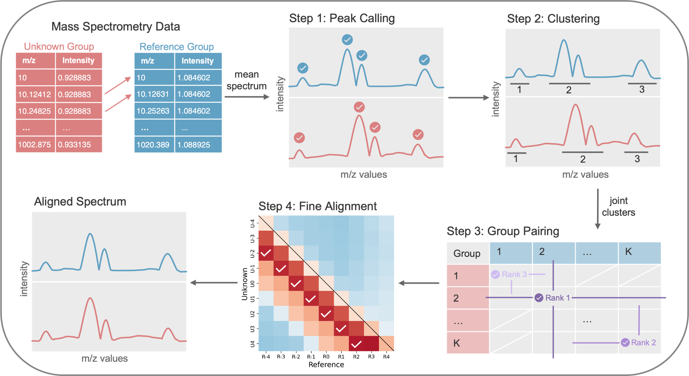

# GALAXY

**Group Alignment of Mass Spectrometry data** &mdash; a peak-group-based
algorithm for aligning mass spectrometry (MS) spectra onto a common m/z grid.

GALAXY is designed for imaging and spatial metabolomics data such as MALDI-MS,
where spectra from different runs or tissues exhibit small m/z shifts that
prevent direct comparison. By aligning an "unknown" spectrum to a reference
while forcing matched spectra to share m/z values, GALAXY enables:

- joint spatial segmentation across tissues or time points
- classification using combined datasets
- other multi-sample analyses that require a common m/z grid

## At a glance

| Step | Manuscript section          | Object &middot; method                                   |
|-----:|-----------------------------|----------------------------------------------------------|
| 1    | Peak Calling                | `PeakCalling.peak_calling(threshold=0.9)`                |
| 2    | Peak Grouping               | `PeakCalling.peak_grouping(percentile=0.9)`              |
| 3    | Peak Group Pairing          | `AnnDataMALDI.peak_group_pairing(criteria=0)`            |
| 4    | Fine Alignment Assessment   | `AnnDataMALDI.fine_alignment_assessment(threshold=0.2)`  |

Similarity is measured with Pearson's correlation; Step 3 uses a sliding window
of &plusmn;4 m/z units. See [Tutorial](tutorial.md) for an end-to-end walk-through.

## Next steps

- [Install GALAXY](install.md)
- [Walk through the tutorial](tutorial.md)
- [Try the bundled toy data](toy-data.md)
- [Browse the API reference](api/peak-calling.md)
- [Reproduce the manuscript figures](case-studies.md)
- [Cite the paper](citation.md)
